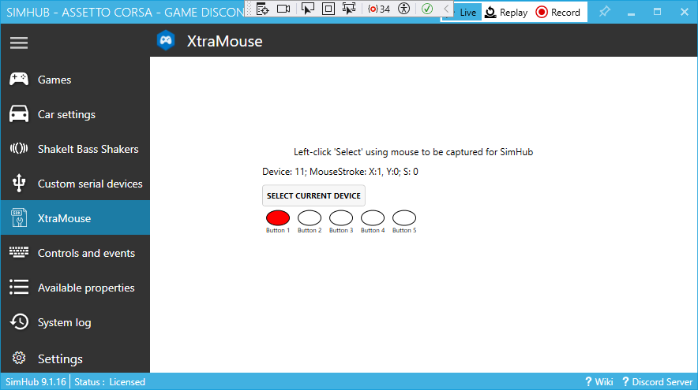

# XtraMouse
 SimHub plugin to intercept selected extra mouse events

- Repo created by GitHub Desktop:  
	  
- Created a new `XtraMouse` Visual Studio 2022 solution elsewhere  
	deleted its `.vs/` `obj/` and `Properties/` folders
- Copied the rest of that new solution to the new repo
- To insert SimHub example in new solution and project name:    
	Use [VIM](https://www.vim.org/download.php) split diff with [`SimHubPluginSdk`](../SimHubPluginSdk) folder:
	- push SimHub `VisualStudioVersion` to `XtraMouse.sln`;  
		and remove its `GlobalSection`  
	- push SimHub `<Project ToolsVersion` to `XtraMouse.csproj`  
		copy `<AppDesignerFolder>`,  
		push `<TargetFrameworkProfile>` and `<OutputPath>`  
		push `<OutputPath>` and `<StartProgram>` `<PropertyGroup`  
		push `<Reference Include` `<ItemGroup>`  
	- push `<Compile Include` `<ItemGroup>`, with  
		`"DataPlugin.cs"` replacing `"UserControl1.cs"` and  
		`"SettingsControl.xaml.cs"` replacing `"UserControl1.Designer.cs"`  
	- push `<Page Include="Properties\DesignTimeResources.xaml"` `<ItemGroup>`
- Replace corresponding source files
- use VIM to
	- replace `SimHubPluginSdk` with `XtraMouse`
- copy all but `AssemblyInfo.cs` from [`SimHubPluginSdk/Properties/`](../SimHubPluginSdk/Properties/) to `XtraMouse/Properties/`
- [PropertyChanged code](https://github.com/Fody/PropertyChanged) for "live" XAML
#### mouse interception plugin issues
- [elapsed time from plugin end to restart](https://stackoverflow.com/questions/2821040/how-do-i-get-the-time-difference-between-two-datetime-objects-using-c)
- continue using a mouse if the same device number and hardware ID? 

### porting from XPF_XAML
1. start with view model class `DataViewModel`, limit to 5 mouse buttons  
	builds OK
2. Add [reference for `using InputInterceptorNS;`](https://github.com/blekenbleu/InputIntercept) to XtraMouse in VS Solution Explorer:  
	`<HintPath>..\..\..\GitHub\InputIntercept\InputInterceptor\bin\Release\netstandard2.0\InputIntercept.dll</HintPath>`
3: Add `Intercept.cs` and class with trivial contents:  

<details><summary>trivial <code>Intercept.cs</code></summary>
<pre>
using InputInterceptorNS;
using System;

namespace XtraMouse
{
    internal class Intercept
    {
        public static short Captured = 0;
        public delegate void WriteStatus(string s);
        static WriteStatus Writestring = Console.WriteLine;
        public delegate void ButtonDel(ushort index, bool down);
        static ButtonDel ButtonEvent = Dummy;
        public static short[] Stroke = { 0,0,0,0,0 };


        static void Dummy(ushort index, bool down) { }

        public Intercept()
        {
        }
    }
}
</pre>
</details>

	**Note**:&nbsp; adding `Intercept.cs` file in VS *does NOT* add the class;  
	that is a separate step under Solution Exploder, what a PoS...  
4: replaced SimHUb demo UI XAML content with WPF_XAML;&nbsp; added skeleton code to eliminate warnings  
	  
5: For `MouseHook` callback syntax added to `XtraMouse.csproj`:
```
  <PropertyGroup>
    <LangVersion>9.0</LangVersion>
  </PropertyGroup>
```


